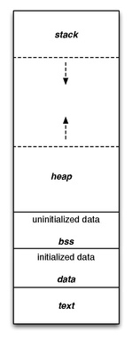

# x86 x64 assembly webinar code

I have been dealing with assembly and reverse engineering binaries for a while now as hobby.
So when I got an oppourtunity to deliver a webinar hosted by GM University, Sambalpur I took it up.

Now I don't know how others prefer to do it but I think if you can Google up most of the opcodes but some basic stuff that you should keep in mind are how the memory layout is and the registers available.




# Sections

### 1. Hello World
Since the dawn of programming languages this has been the way we make computers greet. Here we demonstrate how to do `syswrite(STDIN, "Hello, World!\n", 13)` in assembly. How to load registers and make things move.

### 2. Conditional
This section deals with the jump calls, comparisons of registers andt setting the flags, making calls by tag names.

### 3. User input
The goal of demonstrating this was not to show how you can see the user input data but to how to fill undeclared data.

### 4. Maths
Just the basic ALU operations that are possible and how to use the stack for real. Also we show you how to print a digit, if you think this is straight forward I insist you to take a look at it.

### 5. Subroutine
To make it sound easier we just show how to write functions in assembly. The cool thing I could add to it was that in `syswrite(STDIN, "Hello, World!\n", 13) ` the 13 (i.e. the length of bytes) was caluclated automatically.

### 6. Macros
Shortening our code we learn to write macros and pass parameters to it and also import assembly code from files.

### [BONUS] Smashing the stack
If you have ever wondered how hackers manage to pirate a game by cracking the software then you need to take a look at this.

So let's try to run the binary in smashingthestack folder and see what's inside.
```sh
$ ./crackthat 
What's the password? GUESS   
You failed
```
Seems like there's a password let's try to break in.

Here I will be using a tool called radare to do the disassemble the binary.
First we gather some information about the binary
```
$ rabin2 -I crackthat 
arch     x86
binsz    6759
bintype  elf
bits     64
canary   true
class    ELF64
crypto   false
endian   little
havecode true
intrp    /lib64/ld-linux-x86-64.so.2
lang     c
linenum  true
lsyms    true
machine  AMD x86-64 architecture
maxopsz  16
minopsz  1
nx       true
os       linux
pcalign  0
pic      true
relocs   true
relro    partial
rpath    NONE
static   false
stripped false
subsys   linux
va       true
```
So now we know that it is an x64 binary maybe we can gather our knowledge of assembly to jump in and see how this is working.

Let's try to see if we can find the password string
```sh
$ rabin2 -z crackthat 
000 0x000009e4 0x000009e4  21  22 (.rodata) ascii What's the password? 
001 0x000009fd 0x000009fd   7   8 (.rodata) ascii radare2
002 0x00000a05 0x00000a05  15  16 (.rodata) ascii Congratulations
003 0x00000a15 0x00000a15  28  29 (.rodata) ascii What's the second password? 
004 0x00000a32 0x00000a32  27  28 (.rodata) ascii What's the third password? 
005 0x00000a4e 0x00000a4e  10  11 (.rodata) ascii You failed
006 0x00000a59 0x00000a59  22  23 (.rodata) ascii Flag is: r2{%s %s %s}\n
```
WOW so many strings!o

Let's try one! Let's try "radare2"
```sh
$ ./crackthat 
What's the password? radare2
Congratulations
What's the second password? radare2
You failed
```
Great we managed to break the first password, but failed on the second string  let's dive into the disassembler to see how the checks are working
```sh
$ radare2 crackthat 
 -- Learn pancake as if you were radare!
[0x000006f0]> aaa
[x] Analyze all flags starting with sym. and entry0 (aa)
[x] Analyze len bytes of instructions for references (aar)
[x] Analyze function calls (aac)
[x] Use -AA or aaaa to perform additional experimental analysis.
[x] Constructing a function name for fcn.* and sym.func.* functions (aan)
[0x000006f0]> s main
[0x000007fa]> VV
```
If you move your cursor you could follow a trail to the jump calls just look for the comparisons and jump calls you will bump into things. Look for the lines below to find the second password.
```
call sym.imp.__isoc99_scanf;[gb]                                  
lea rax, [local_40h]                                
mov rdi, rax                   
call sym.imp.atoi;[gg]         
mov dword [local_64h], eax
; [0xf:4]=0x3e000300                                
cmp dword [local_64h], 0xf
jne 0x906;[gd]
```
 You might observe there is atoi which means string has been converted to integer.
 Our password must be an integer and if you see the comparison is to a hex `0xf` which is nothing but `15` in decimal.
 
 ```sh
 $ ./crackthat 
What's the password? radare2
Congratulations
What's the second password? 15
Congratulations
What's the third password? 
 ```
 Now you have learnt enough to crackf the third one on your own. Try it out and ask me if you get stuck. Add a star if you liked this.
 Go break some eggs!
 
 Feel free to contact me if you need to know more.
schakravorty846@gmail.com